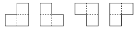
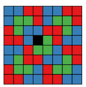
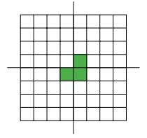
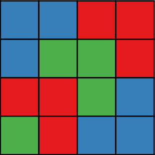
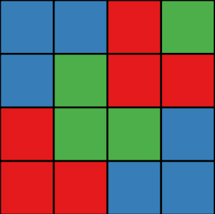

# Tromino Tiling Algorithm

## Problem Concept
Let's say we want to cover a surface using tiles, with specific shapes, and we want to achieve this so that there are no gaps in the surface, and no overlaps. This problem is called tessellation or tiling. For this project we aim to build an algorithm that creates a 2^n * 2^n table and fills it with L-shaped trominos. The trominos can be used in four orientations (corresponding to 90 degree rotations).

Since each tromino consists of three tiles, the square cannot be perfectly covered. In the best solution there will be one square left empty, a hole. This is unavoidable.

Also, to solve the above problem we wont use libraries that will solve the problem for us.

## Tromino direction solution
Our objective is to fill the table with trominos and minimise the number of empty cells. To fill the table with trominos of L shape, we must adopt a structured approach to placing them. The following steps will be used to achieve this. 

1. **Insert a tromino in the centre of the table.**
2. **Cut the table in 2^(n-1) * 2^(n-1). If the length is greater that 2^2 * 2^2 go to first quarter and repeat step 1. Otherwise, go to step 3.**
3. **Fill the table if its length is 2^2 * 2^2.**

When we need to place the trominos a new issue arises. There are four different ways to do this. The trominos are like arrows, so we can place them with the noise looking in:

    Bottom right
    Bottom left
    Upper right
    Upper left

 So, we need a structured way to place them cause brute force methods are not a solution. If we look up the way that the trominos are placed we can see that there is a pattern in the way that they are placed. The solution lies in the step that we place a tromino in the center. By doing that and then cutting the table we end up with 3 out of 4 quarter having one tile filled in the corners of the sub-table. When we will try to fill a quarter table with one cell filled, the position of this cell will tell us how to place the trominos. Lets dive deeper with the certain steps.

We start with:

1. If the table's length is greater than 2^2 * 2^2, then place a tromino in the center of the table with the noise looking Bottom right.

2. Cut the table in 2^(n-1) * 2^(n-1) and take the first. The first quarter will be completly empty rather than the rest of the quarters that will have one cell filled.

    

3. We will continue placing a tromino in center of the table and cutting it till we end up in a table that is 2^2 * 2^2.

4. If the table is 2^2 then fill the table. The first time we will find a table with length 2^2 * 2^2 will be completly empty, so the filling will be in a strict way. All the other times the table will have one cell filled.

    

5. Then if the table is 2^2 * 2^2 check the 4 corners to find the filled cell and place trominos in the opposite direction of corner till the opposite corner that you found it. This means that if the filled cell is in the bottom left then place the midle trominos of the 2^2 * 2^2 table with a direction of top right. If the filled cell is in the upper right then place the midle trominos of the 2^2 * 2^2 table with a direction of bottom left. The other 2 trominos will must place have standar possitions.

    
    

## Tromino coloring solution

After solving the direction of the trominos we will place we must also solve the problem of the coloring we will be giving to each tromino in order not to have same colors placing together. The solution to this is simple cause the only thing we need to do is to place the blue color in the upper left and bottom right, the red in the upper right and bottom left and the green in the center so there will never be a side in common with the same colors.

## How to run
In order to run this algorithm the only thing you need to do is download the 2 python files in one directory, access it through the cmd and run 

    python tromino_tiling.py 3

the 3 is the n that will be used to create the table. if you enter 3 then the table will be 2^3 * 2^3 = 8 * 8
